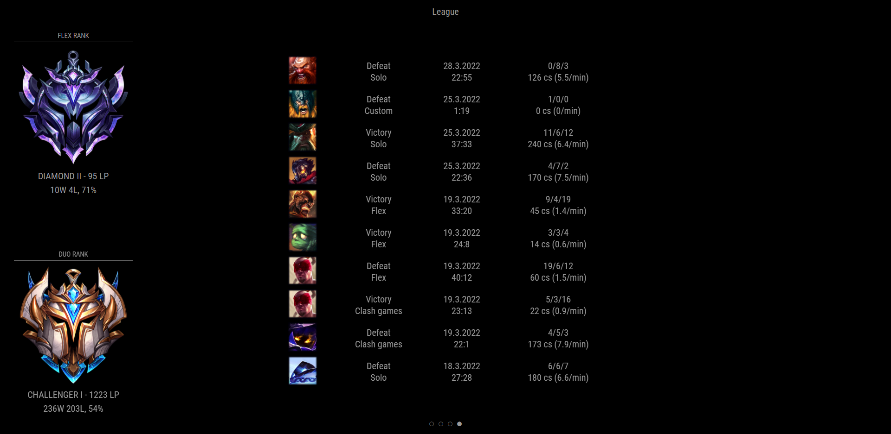

# MMM-LeagueOfLegends

This is a module for the [MagicMirror²](https://github.com/MichMich/MagicMirror/).

A module to display your League Of Legends stats on your MagicMirror².

This is an example that uses this module 3 times: On the left hand side it displays the current rank in Solo and Flex Queue. In the middle it shows a match history of the latest 10 games.



## Requirements

1. Riotgames Developer Profile
2. Riotgames Developer API-Key

Both of those are free to create, although it **might take a few days**, to get your application verified!

To use this module, you first need to sign up for the [Riotgames Developer Program](https://developer.riotgames.com/).

Next you need to register your Application with a `PERSONAL API KEY` by clicking the "Register Product"-Button on your Dashboard and selecting "Personal API Key". You then have to fillout a short from with information about the purpose of your "product" and submit this.

For me, it took a few days to get my application registered.

If your App is registered, you can head over to your "Apps" (by clicking on your username in the upper right corner and selecting "Apps") and choose your App on the left hand side. You should now see general Information about your App along with an "API-Key", looking something like this: `RGAPI-291b3053-432c-737l-28aj-416d3j21ag28` (not a real key, just an example!)

You are then ready to use this module.

## Installation

1. Navigate to your modules folder in a terminal:

```bash
cd modules
```

2. Clone this repository:

```bash
git clone https://github.com/JulianEgbert/MMM-LeagueOfLegends.git
```

### Updating

To update this module, navigate to the module folder (`cd modules/MMM-LeagueOfLegends`) and pull from the repository using:

```bash
git pull
```

## Using the module

To use this module, add the following configuration block to the modules array in the `config/config.js` file:

```js
var config = {
  modules: [
    { // Display your rank
      module: 'MMM-LeagueOfLegends',
      position: "middle_center",
      config: {
        summonerName: "YOUR_SUMMONER_NAME",
        region: "euw1",
        queueType: "RANKED_SOLO_5x5",
        apiKey: "YOUR_RIOT_API_KEY",
        displayElements: [
          {
            name: "tier",
            config: {
              hideDetailedRankInfo: true
            }
          },
          {
            name: "stats",
            config: {
              showHotStreak: true
            }
          }
        ],
      }
    },
    { // Display your match history
      module: 'MMM-LeagueOfLegends',
      position: "middle_center",
      config: {
        summonerName: "YOUR_SUMMONER_NAME",
        apiKey: "YOUR_RIOT_API_KEY",
        region: "euw1",
        matchRegion: "europe",
        displayElements: [
          {
            name: "history",
            config: {
              count: 10
            }
          },
        ],
      }
    },
  ]
}
```

## Configuration options

| Option           | Description
|----------------- |-----------
| `apiKey`         | *Required* Your own API-Key for the Riot API.
| `summonerName`   | *Required* Your summoner name.
| `displayElements`| *Required* The elements that should be displayed in this module. **Type**: Array of objects, see ["Display Elements"](##Display-Elements).
| `region`         | *Required* The region you are playing in (as stated in the riot api description). <br /> **Possible values**: `euw1` (default), `br1`, `eun1`, `jp1`, `kr`, `la1`, `la2`, `na1`, `oc1`, `ru`, `tr1`
| `matchRegion`         | *Required for history* The region you are playing in. It's different because the match API has different regions from the profile API. <br /> **Possible values**: `europe` (default), `americas`, `asia`
| `imageFolder`    | *Optional* The path to the folder with the tier icons. <br /> **Possible values**: `"emblems"` (default, new icons), `"tiers"` (old icons), or your custom folder name if you add one.
| `iconSize`       | *Optional* Size of the tier icon. <br /> **Default:** `256`
| `startDelay`     | *Optional* Time to wait before starting the module. Necessary if you have multiple modules because the number of API calls is time restricted. <br /> **Default:** `0`
| `updateInterval` | *Optional* How often the module reloads. <br /> **Default:** `300000` (5 minutes)
| `language`       | *Optional* Language used for the *time* display (everything else is currently english only!). <br /> **Default:** `en-EN`
| `queueType`      | *Optional* The queue you want to display your Elo from. <br /> **Possible values**: `"RANKED_SOLO_5x5"` (default, Solo-Queue), `"RANKED_FLEX_SR"` (Flex-Queue)
| `showOtherQueueIfNotFound` | *Optional* Whether the module should display another queue elo if specified queue is not found. <br />**Type:** Boolean, default: `false`


## Display Elements

Here is an overview of all the supported display elements. They are an object with `name` and `config` (*optional*) for configurations. If no config is provided, default values will be used.

| Option        | Description
|---------------|-----------
| `tier`        | Displays the icon of your rank. <br /> **Config**: `hideDetailedRankInfo`: *boolean* (**default** `false`), wether or not to display the tier name, division and LP.
| `stats`       | Displays the stats for this queue (Wins, Losses, Winrate). <br /> **Config**: `showHotStreak`: **Type** Boolean (**default** `false`), wether or not to display a flame icon, when the summoner has a hotstreak (provided by the riot API).
| `summoner`    | Displays the summoner name. <br /> **Config**: `showLevel`: *boolean* (**default** `false`), wether or not to display the level of the user.
| `clash`       | Displays the schedule of the next clash tournaments. <br /> **Config**: `count`: *number* (**default** `5`), number of upcoming tournaments to display. <br /> `fadeOut` (default `true`), wether the last two entries should fade out (lower opacity)
| `history`     | Displays the latest games with brief information. <br /> **Config**: `count` (default `5`): number of matches to display. <br /> `showTime` (default `true`): display date of game and game duration. <br /> `showStats` (default `true`): display stats of the game (kda and cs). <br /> `showQueue` (default `true`): display queue and win or loss. <br /> `showChampion` (default `true`): display the champion splashart. <br /> `iconSize` (default `64`): size of the champion icon in the history <br /> `csPerMinute` (default `true`): display cs per minute after cs score. <br /> `fadeOut` (default `true`), wether the last two entries should fade out (lower opacity)
| `live`        | Display your current live game. <br /> **Config**: `notIngameText` the text it displays when you are not ingame (default `"Currently not in a game"`).
| `html`        | Display custom html content. <br /> **Config**: `html` the html content you want to display.
